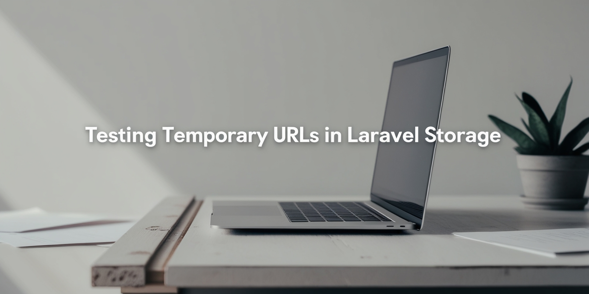

# How to Test Laravel's `Storage::temporaryUrl()`

Laravel's `Storage` facade makes file handling a breeze, but testing features like `temporaryUrl()` can be tricky - especially when using `Storage::fake`, which doesn't support temporary URLs out of the box.

This article walks you through **two practical ways** to test `temporaryUrl()` safely and reliably:

* Mocking the filesystem when using a fake storage
* Mocking the `Storage` facade directly

Both methods let you write clean, isolated tests without relying on real storage services.

📎Read the full article: [How to Test Laravel's `Storage::temporaryUrl()`](https://dev.to/tegos/testing-temporary-urls-in-laravel-storage-20p7)